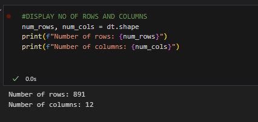

# EXNO2DS
# AIM:
      To perform Exploratory Data Analysis on the given data set.
      
# EXPLANATION:
  The primary aim with exploratory analysis is to examine the data for distribution, outliers and anomalies to direct specific testing of your hypothesis.
  
# ALGORITHM:
STEP 1: Import the required packages to perform Data Cleansing,Removing Outliers and Exploratory Data Analysis.

STEP 2: Replace the null value using any one of the method from mode,median and mean based on the dataset available.

STEP 3: Use boxplot method to analyze the outliers of the given dataset.

STEP 4: Remove the outliers using Inter Quantile Range method.

STEP 5: Use Countplot method to analyze in a graphical method for categorical data.

STEP 6: Use displot method to represent the univariate distribution of data.

STEP 7: Use cross tabulation method to quantitatively analyze the relationship between multiple variables.

STEP 8: Use heatmap method of representation to show relationships between two variables, one plotted on each axis.

## CODING 
```py
import pandas as pd
import numpy as np
import matplotlib.pyplot as plt
import seaborn as sns

# Read the dataset
dt = pd.read_csv("titanic_dataset.csv")

# Display number of rows and columns
num_rows, num_cols = dt.shape
print(f"Number of rows: {num_rows}")
print(f"Number of columns: {num_cols}")

# Set PassengerId as index column
dt.set_index('PassengerId', inplace=True)

# Describe the dataset
dt.describe()

# Categorical data analysis
# Using value_counts() to perform categorical analysis
categorical_columns = ['Sex', 'Pclass', 'Embarked']
for col in categorical_columns:
    print(f"Value counts for column {col}:")
    print(dt[col].value_counts())
    print("\n")

# Univariate analysis
# Countplot for 'Survived' column
plt.figure(figsize=(8,5))
sns.countplot(x='Survived', data=dt)
plt.title('Survival Count')
plt.xlabel('Survived')
plt.ylabel('Count')
plt.show()

# Identify unique values in "Pclass" column
unique_pclass = dt['Pclass'].unique()
print("Unique values in 'Pclass' column:", unique_pclass)

# Renaming the 'Sex' column to 'Gender'
dt.rename(columns={'Sex': 'Gender'}, inplace=True)

# Bivariate analysis
# Catplot for bivariate analysis
plt.figure(figsize=(8,5))
sns.catplot(x='Survived', hue='Pclass', col='Gender', kind='count', data=dt)
plt.show()

# Boxplot for analyzing 'Age' and 'Survived' columns
plt.figure(figsize=(8,5))
sns.boxplot(x='Survived', y='Age', data=dt)
plt.title('Age vs Survived')
plt.show()

# Multivariate analysis
# Boxplot for analyzing 'Pclass', 'Age', and 'Gender'
plt.figure(figsize=(10,6))
sns.boxplot(x='Pclass', y='Age', hue='Gender', data=dt)
plt.title('Age distribution across Pclass and Gender')
plt.show()

# Catplot for analyzing 'Pclass', 'Survived', and 'Gender'
plt.figure(figsize=(10,6))
sns.catplot(x='Pclass', hue='Survived', col='Gender', kind='count', data=dt)
plt.show()

# Heatmap and pairplot
# Heatmap for correlation
plt.figure(figsize=(10,6))
sns.heatmap(dt.corr(), annot=True, cmap='coolwarm')
plt.title('Correlation Heatmap')
plt.show()

# Pairplot for exploring relationships between variables
sns.pairplot(dt)
plt.title('Pairplot of the Dataset')
plt.show()

```
## OUTPUT





# RESULT       
 ### Thus, the Exploratory Data Analysis on the given data set was performed successfully.
